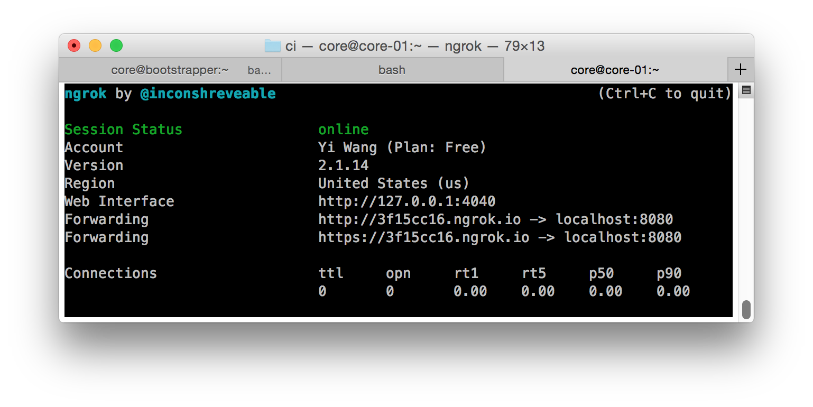

# Build
## Build docker image
```
docker build . -t ci
```
## Build on a normal machine
```
go get ./...
go build .
```

# Unit test
```
go test ./...
```

# Run
## Create configuration file `ci.yaml`
### Description
```
concurrent: concurrent ci job count
env:
  key value pair of environment variables for ci script
github:
  description: description for this ci job. Will be displayed on github build status
  token: your personal access token
  owner: repo owner name
  name: repo name
  filename: script for ci to run relative to repo folder
  endpoint: ci server endpoint name, build status on github will reference this endpoint
```
### Example
```
concurrent: 5
env:
  CI_OS: osx
github:
  description: build on mac
  token: your-personal-access-token
  owner: PaddlePaddle
  name: Paddle
  filename: ci.sh
  endpoint: http://87b93f06.ngrok.io
```
## Start ci server
### Run using docker image
```
mkdir ci_data
cd ci_data
cp ci_yaml_dir/ci.yaml .
docker run -p 8000:8000 -v $(pwd):/data -v /var/run/docker.sock:/var/run/docker.sock ci
```
#### Explanation: -v /var/run/docker.sock:/var/run/docker.sock
This flag will expose docker daemon on host machine to docker client inside docker container. So build command like `docker build` could run inside docker container.
#### Explantion: -v $(pwd):/data
This flag will mount `$(pwd)` into `/data` inside docker container, `ci` binary will use default db path `/data/ci.db` and default ci.yaml path `/data/ci.yaml` if not specified.
#### Explanation: -p 8000:8000
This flag will map port 8000 outside docker to 8000 inside docker. `ci` binary will use default port 8000 if not specified.

### Run binary built on normal machine
```
path_to_ci/ci -config ci_yaml_dir/ci.yaml -db ci.db -port 8000 -template path_to_repo/templates
```
#### Flag explanation
```
Usage of ./ci:
  -config string
    configuration file (default "/data/ci.yaml")
  -db string
    path to db (default "/data/ci.db")
  -port int
    ci server port (default 8000)
  -template string
    ci server template directory (default "/templates")
```

# Generate personal access token
Github -> Settings -> Personal Access Tokens -> Generate New Tokens

Select permission "public_repo  Access public repositories" and generate new token.

# Endpoint and github webhook
Endpoint is the base url that one (user and github webhook) could access ci server. This base url needs to be accessable from public internet (e.g., by github)

## ngrok
Ngrok can expose a local server behind a NAT or firewall to the internet.

### Download and installation
https://ngrok.com/download

### Run
```
ngrok http 8000 // 8000 is ci server default port
```
This will bring up a fullscreen UI like the following:



Please be aware of the URLs shown in the figure -- once we run CI locally and make it listening on 8000, we will be able to access CI through any of those URLs.

According to above figure the endpoint (a field to fill inside `ci.yaml`) name is: https://3f15cc16.ngrok.io (or http://3f15cc16.ngrok.io)
And webhook URL is https://3f15cc16.ngrok.io/ci (or http://3f15cc16.ngrok.io/ci)

## Setup webhook on github
Repo -> Settings (if you can not see it, you probably don't have enough permission for this repo) -> Webhooks -> Add webhook

Paste webhook URL inside "Payload URL". E.g., https://3f15cc16.ngrok.io/ci (don't forget tailing `/ci`)

Select "Let me select individual events."

Select "Push"

Select "Pull request"

Click "Add webhook"
